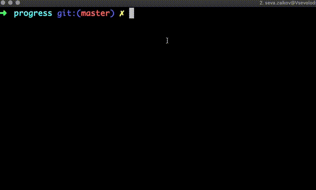

## Progress status

Simple npm package to report progress of long tasks.



## Installation

```sh
npm install --save progress-status
```

In order to use it, you need Node.js 8+. however, I think it should work on lower versions as well, but I have not tested it.

## Usage

You can use it in two ways – as a global function or as a local one. Global might be updated from everywhere, without passing it directly (just requiring it).

```sh
const progress = require("progress-status");

async function testGlobal() {
  for (let i = 0; i < 1e3; i++) {
    await new Promise(resolve => setTimeout(resolve, 5));

    progress(i / 1e3);
  }
}
```

You can do it in any file and pass a corresponding value (where 0 is beginning, 1 is end).
You can also create it locally and pass around:

```sh
const { createProgress } = require("progress-status");
async function testLocal() {
  const localProgress = createProgress();
  for (let i = 0; i < 1e3; i++) {
    await new Promise(resolve => setTimeout(resolve, 5));

    localProgress(i / 1e3);
  }
}
```

## License

MIT